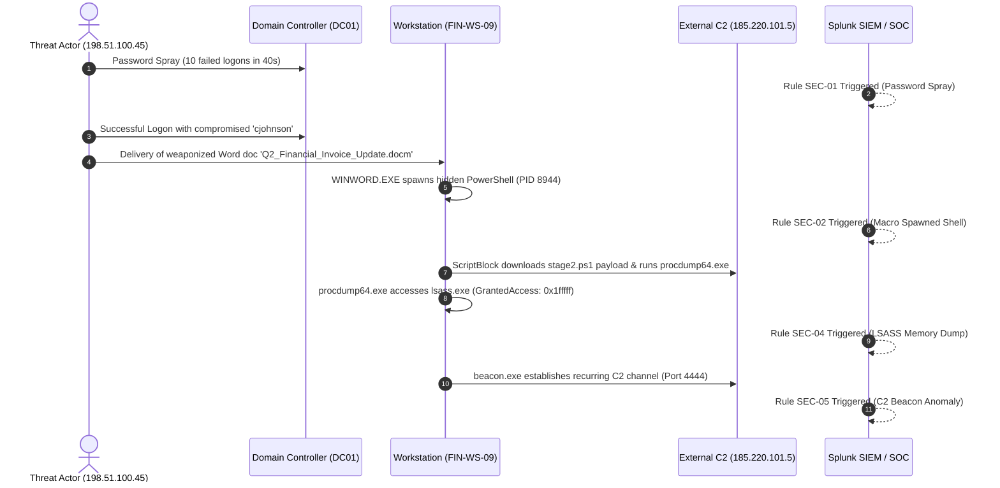

# SOC Tier-1 / Tier-2 Incident Escalation & Forensics Report
## Incident ID: INC-2026-0418-092 | Severity: CRITICAL (P1)

---

### 1. Incident Overview & Classification

| Incident Field | Value |
| :--- | :--- |
| **Incident Title** | Phishing Macro Execution Leading to LSASS Memory Dumping & C2 Beaconing |
| **Date & Time (UTC)** | 2026-04-18 14:32:00 UTC – 15:20:00 UTC |
| **Impacted Host** | `FIN-WS-09.CORP.LOCAL` (IP: `192.168.10.42`) |
| **Target User** | `CORP\cjohnson` (Finance Department Lead) |
| **Attacker Infrastructure** | `198.51.100.45` (Initial Spray), `185.220.101.5` / `c2-threat.lab` (C2 Server) |
| **MITRE Tactics / Techniques** | Initial Access (T1110, T1204), Execution (T1059.001), Credential Access (T1003.001), Command & Control (T1071.001) |
| **Incident Commander** | Lead SOC Analyst |

---

### 2. Attack Execution Timeline

1. **14:32:01 – 14:32:38 UTC**: Threat actor initiated password spraying attack from `198.51.100.45` against Active Directory, generating 10 failed logon events (Event ID 4625).
2. **14:32:55 UTC**: Compromised account `cjohnson` authenticated successfully (Event ID 4624).
3. **15:10:12 UTC**: Malicious macro embedded in `Q2_Financial_Invoice_Update.docm` executed, spawning hidden `powershell.exe` with Base64 encoded payload.
4. **15:10:14 UTC**: PowerShell Event ID 4104 captured dynamic download cradle retrieving secondary payload from `http://c2-threat.lab/stage2.ps1`.
5. **15:12:05 UTC**: Threat actor executed `procdump64.exe`, opening a handle with full access (`0x1fffff`) to `lsass.exe` and dumping memory to `C:\Windows\Temp\lsass.dmp`.
6. **15:16:01 UTC**: Persistent beacon binary `beacon.exe` initiated recurring outbound connections to `185.220.101.5:4444`.

---

### 3. Indicators of Compromise (IOCs)

| IOC Type | Value | Context |
| :--- | :--- | :--- |
| **IPv4 Address** | `198.51.100.45` | External Password Spray Origin |
| **IPv4 Address** | `185.220.101.5` | Command & Control (C2) Server |
| **Domain** | `c2-threat.lab` | Staging & Payload Host |
| **File Name** | `Q2_Financial_Invoice_Update.docm` | Phishing Weaponized Attachment |
| **File Hash (SHA256)** | `9A588B4B87CE12984180AE7B21447D08518FE27CEEFEAEBD029F64B3BBEF479C` | PowerShell Execution Payload |
| **File Path** | `C:\Windows\Temp\lsass.dmp` | Staged Credential Dump File |
| **File Path** | `C:\Windows\Temp\PSEXESVC.exe` | Lateral Movement Artifact |

---

### 4. Containment & Remediation Actions Taken
- **Host Isolation**: Workstation `FIN-WS-09` isolated from network via EDR at 15:22 UTC.
- **Account Reset**: Disabled `CORP\cjohnson`, revoked all Kerberos and OAuth cloud tokens, and scheduled forced password change.
- **Firewall Rule**: Perimeter block implemented for `198.51.100.45` and `185.220.101.5`.
- **Eradication**: Malicious binaries and dumps in `C:\Windows\Temp\` deleted; host scheduled for full re-image.

---

### 5. Final Recommendations
1. Enforce FIDO2 / Hardware MFA across all external and internal authentication endpoints.
2. Activate Attack Surface Reduction (ASR) rule `D4F940AB-401B-4EFC-AADC-AD5F3C50688A` (Block Office from creating child processes).
3. Enable Windows Defender Credential Guard to prevent memory dumping of LSASS.
